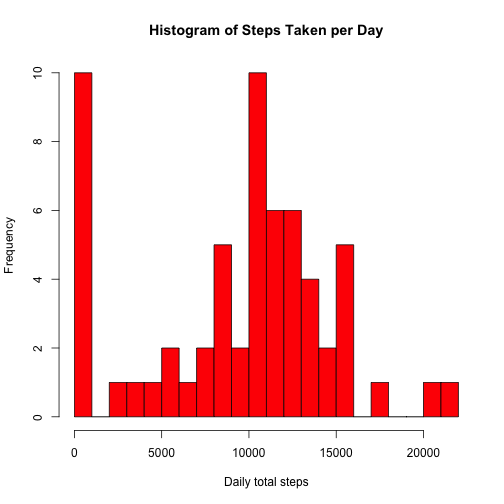
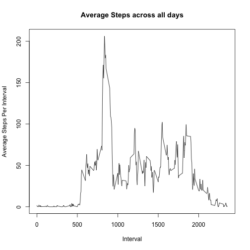
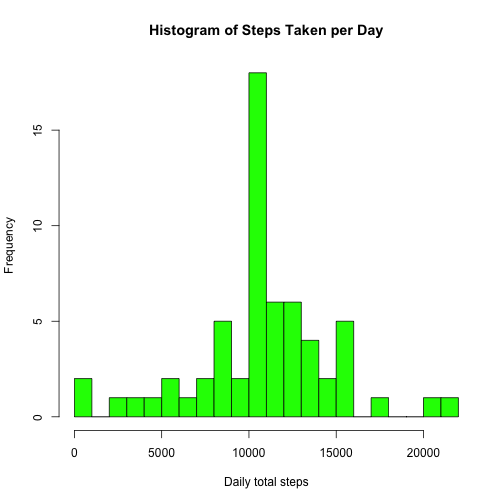

#Reproducible Research - Peer Assessment 1
<br>

##Loading and preprocessing the data
###Load libraries

```r
library(plyr)
```
###Load the data for this project from the working directory

```r
activityData <- read.csv('activity.csv')
```
<br>

##What is mean total number of steps taken per day?
###Calculate the number of steps taken per day

```r
stepsPerDay <- tapply(activityData$steps, activityData$date, sum, na.rm=TRUE)
```
###Histogram of the total number of steps taken each day

```r
hist(x=stepsPerDay,col="red",breaks=30,xlab="Daily total steps",ylab="Frequency",main="Histogram of Steps Taken per Day")
```

 

###Calculate and report the mean and median of the total number of steps taken per day

```r
meanSteps <- mean(stepsPerDay)
medianSteps <- median(stepsPerDay)
```
Mean = 9354.2295082  
Median = 10395
<br>
<br>

## What is the average daily activity pattern?
###Calculate the average of steps taken per interval

```r
stepsPerInterval <- ddply(activityData,c("interval"),summarize,meanSteps=mean(steps, na.rm=TRUE))
```
###Plot average number of steps per interval

```r
plot(stepsPerInterval$interval,stepsPerInterval$meanSteps,type="l",xlab="Interval",ylab="Average Steps Per Interval",main="Average Steps across all days")
```

 

###Detemine interval with maximum average number of steps

```r
maxSteps <- max(stepsPerInterval$meanSteps)
maxSteps
```

```
## [1] 206.1698
```

```r
maxStepsInterval <- subset(stepsPerInterval, meanSteps==maxSteps)
maxStepsInterval$interval
```

```
## [1] 835
```

Maximum Steps = 206.1698113  
Interval with maximum steps = 835  
<br>

##Imputing missing values
###Calculate and Report number of rows with missing steps

```r
countNA <- sum(is.na(activityData$steps))
```
Number of rows with missing steps = 2304
<br>

###Fill in NAs with interval average

```r
imputedData <- merge(activityData,stepsPerInterval,by.x="interval",all=TRUE)
nas <- is.na(imputedData$steps)
imputedData$steps[nas] <- imputedData$meanSteps[nas]
stepsPerDayImputed <- tapply(imputedData$steps, imputedData$date, sum, na.rm=TRUE)
```

###Histogram of the total number of steps taken each day - NAs replaced with interval average

```r
hist(x=stepsPerDayImputed,col="green",breaks=30,xlab="Daily total steps",ylab="Frequency",main="Histogram of Steps Taken per Day")
```

 

###Calculate and report the mean and median of the total number of steps taken per day - NAs replaced with interval average

```r
meanStepsImputed <- mean(stepsPerDayImputed)
meanStepsImputed
```

```
## [1] 10766.19
```

```r
medianStepsImputed <- median(stepsPerDayImputed)
medianStepsImputed
```

```
## [1] 10766.19
```
Mean = 1.0766189 &times; 10<sup>4</sup>  
Median = 1.0766189 &times; 10<sup>4</sup>


<br>

## Are there differences in activity patterns between weekdays and weekends?


